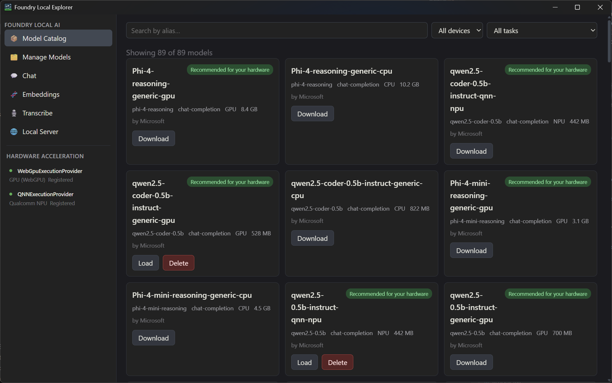
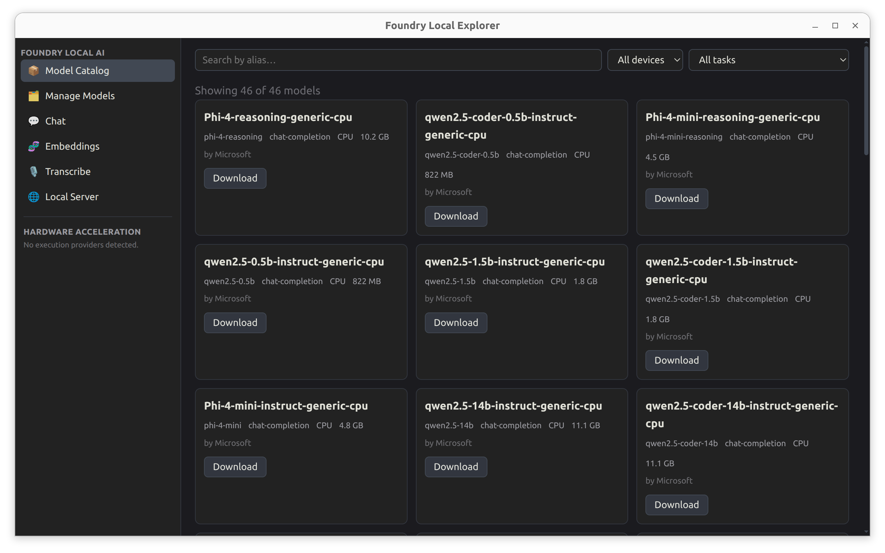

# Foundry Local Explorer

When running AI models on your local machine - everybody thinks of [ollama](https://ollama.com/) or [LM Studio](https://lmstudio.ai/) first. Both tools serve everybody from AI-consumer, hobbyist to developers.
Microsoft [Foundry Local](https://learn.microsoft.com/azure/ai-foundry/foundry-local/) on the other hand is the versatile local AI SDK platform developers use to embed and ship local AI capabilities without cloud dependencies.

But why not building a simple GUI around Foundry Local to expose its capabilities, the model catalogue, the local hardware acceleration and the OpenAI compatible API for easier testing and using it as local AI sandbox?

This is considered a Proof of conecpt and is built on the Electron application framework with React and TypeScript — a desktop GUI for .

## Screenshots

| Windows | Linux | Mac |
|---|---|---|
|  |  | Coming soon |

## Requirements

- **OS**: Windows, macOS, or Linux (the app's hardware/EP detection is powered by the `foundry-local-sdk`, which is cross-platform).
- **Node.js**: 20.x LTS or later, with a matching **npm** (bundled with Node).
- **Foundry Local SDK runtime**: provided through npm dependencies (`foundry-local-sdk` / `foundry-local-sdk-winml`) during install. The `foundry` CLI is optional for this app; EP discovery/registration is SDK-driven.
- **Build tools for native modules**: this project depends on `better-sqlite3`, which compiles a native Node addon on install. Make sure you have the platform's native build toolchain available before running `npm install`.
  - **Windows**: [Visual Studio Build Tools](https://visualstudio.microsoft.com/downloads/) (Desktop development with C++ workload) or `npm install --global windows-build-tools` equivalent, plus Python.
  - **macOS**: Xcode Command Line Tools (`xcode-select --install`).
  - **Linux**: `build-essential`, `python3`, and `make`/`gcc` (e.g. `sudo apt install build-essential python3`).
- **Git** to clone the repository.

## Project Setup

### 1. Clone and install dependencies

```bash
git clone https://github.com/KateiRen/Foundry-Local-Explorer
cd "Foundry-Local-Explorer"
npm install
```

`npm install` also runs `postinstall` (`electron-builder install-app-deps`), which rebuilds native modules (e.g. `better-sqlite3`) against Electron's Node ABI rather than your system Node — this step is required.

### 2. Run in development

```bash
npm run dev
```

This starts `electron-vite` in dev mode with hot reload for the renderer and automatic restarts for main-process changes.

Other useful scripts during development:

```bash
npm run typecheck   # TypeScript checks for both main/preload (node) and renderer (web)
npm run lint        # ESLint
npm run format      # Prettier --write
```

### 3. Build for production

`npm run build` type-checks the project and produces an unpacked `electron-vite build` output in `out/`. The platform-specific commands below additionally package that output into an installable artifact.

```bash
# Windows (produces an NSIS installer, e.g. dist/Foundry-Local-Explorer-<version>-setup.exe)
npm run build:win

# macOS (produces a .dmg, e.g. dist/Foundry-Local-Explorer-<version>.dmg)
npm run build:mac

# Linux (produces AppImage, snap, and deb packages in dist/)
npm run build:linux
```

Notes:
- Building for Windows works from Windows; cross-compiling `build:win` from macOS/Linux (or vice versa) is not supported/tested here.
- `npm run build:unpack` produces an unpacked app directory (via `electron-builder --dir`) without generating an installer — useful for quickly testing a production build locally.
- Packaged builds are unsigned by default (`notarize: false` on macOS, no code-signing config for Windows/Linux); expect an OS security prompt (SmartScreen/Gatekeeper) on first run of the installer.

### 4. Install the built app

- **Windows**: run the generated `dist/Foundry-Local-Explorer-<version>-setup.exe`. It installs via NSIS and creates a desktop shortcut.
- **macOS**: open the generated `dist/Foundry-Local-Explorer-<version>.dmg` and drag `Foundry-Local-Explorer.app` into `Applications`.
- **Linux**: run the `.AppImage` directly (`chmod +x` first), or install the `.deb` (`sudo dpkg -i dist/Foundry-Local-Explorer-<version>.deb`), or install the `.snap`.

In all cases, ensure npm dependencies are installed on the target machine before launching the app — this app talks to Foundry through the bundled SDK runtime dependencies.

## Troubleshooting: Missing Foundry Native Libraries

If you see this error:

```
FoundryLocalCorePath not specified in configuration and could not auto-discover binaries
```

the Foundry native binaries were not downloaded into `node_modules`.

Use this recovery flow from the project root:

```bash
# 1) Ensure a supported Node version
node -v

# 2) Install dependencies (runs Foundry install scripts)
npm install

# 3) If the error persists, force Foundry native reinstall
npm rebuild foundry-local-sdk foundry-local-sdk-winml --foreground-scripts
```

Then fully restart the Electron app (`npm run dev`).

### nvm + env-var quick recovery

If `npm install` / `npm rebuild` did not populate the native Foundry Core binaries, the following `nvm` flow is a reliable recovery path (we use Node 22 LTS for best compatibility):

```bash
# Use Node 22 LTS (via nvm)
nvm install 22
nvm use 22
rm -rf node_modules package-lock.json
npm install
npm rebuild foundry-local-sdk foundry-local-sdk-winml --foreground-scripts
```

If installing/rebuilding still doesn't provide the core binary, either install the Foundry Local runtime system-wide or point the SDK at a local copy of the core binary:

```bash
# Example (adjust path to your system)
export FOUNDRY_LOCAL_CORE_PATH=/path/to/Microsoft.AI.Foundry.Local.Core.so
FOUNDRY_LOCAL_CORE_PATH=/path/to/Microsoft.AI.Foundry.Local.Core.so npm run dev
```

Note: the project's npm `name` used to be a spaced display name; the publishable package identifier is now `foundry-local-explorer`. The app's product/display name remains `Foundry Local Explorer`.

Notes:
- Prefer **Node.js 22 LTS** for this project.
- On Git Bash, run the commands exactly as shown above (avoid shell history expansion issues in ad-hoc one-liners).
